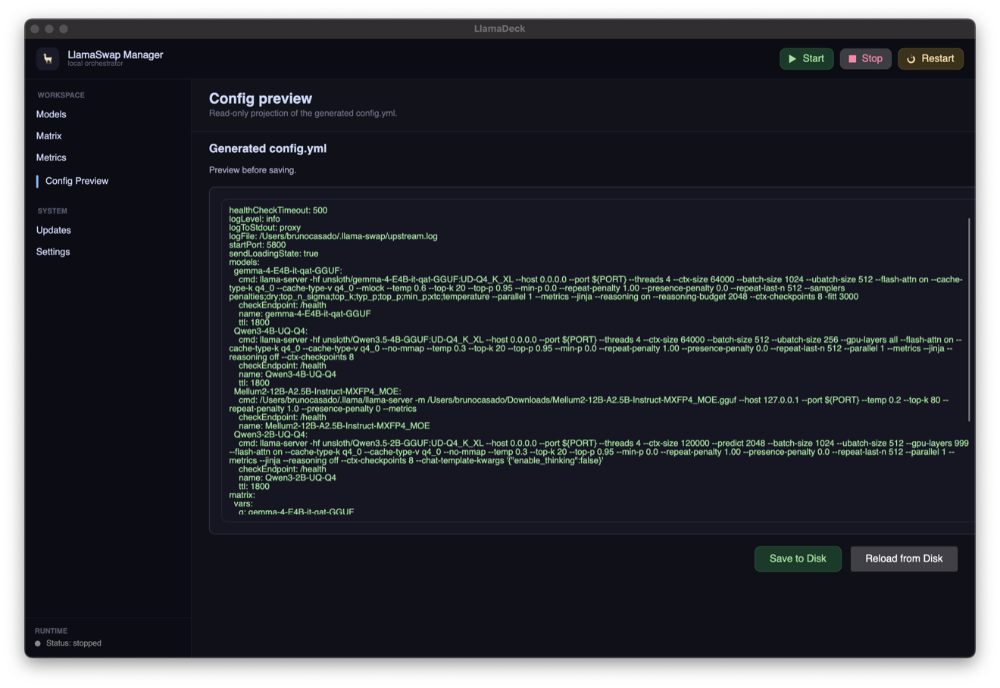
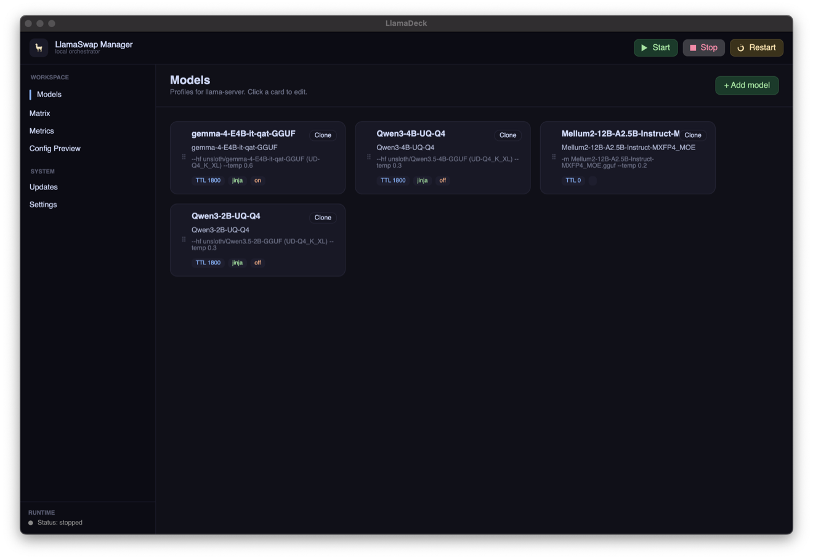

# LlamaDeck

A desktop control center for `llama-swap`, `llama.cpp`, and local GGUF models.

LlamaDeck gives you one place to configure model profiles, manage the local runtime, build loading combinations, inspect generated configuration, and monitor what is running.



## What it does

- Start, stop, restart, and inspect the local `llama-swap` runtime.
- Install and update compatible `llama.cpp` builds.
- Create model profiles using local GGUF files or Hugging Face repositories.
- Configure common `llama-server` runtime, GPU, cache, sampling, server, and reasoning options.
- Build model-loading combinations and eviction priorities visually.
- Preview and save the generated `config.yml`.
- View runtime metrics, loaded models, and application logs.
- Check for LlamaDeck, `llama-swap`, and `llama.cpp` updates.

## Model combinations

Define which models can remain loaded together and control their eviction order without editing YAML manually.



## Requirements

- .NET 9 SDK when building from source.
- A supported `llama-swap` binary.
- A compatible `llama.cpp` `llama-server` build.

Default locations:

```text
~/.llama-swap/llama-swap
~/.llama-swap/config.yml
~/.llama/llama-server
```

On Windows, LlamaDeck also detects `llama-swap.exe` in the application directory, `~/.llama-swap`, or `PATH`.

## Run from source

```bash
dotnet run --project LlamaSwapManager.Desktop
```

## Build and test

```bash
dotnet build
dotnet test Tests/LlamaSwapManager.Tests/LlamaSwapManager.Tests.csproj
```

## Platform support

LlamaDeck is built with Avalonia and targets Windows, macOS, and Linux. Runtime installation and process behavior can vary by operating system, so platform-specific testing is welcome.

## Project status

LlamaDeck is under active development. The public product name has changed from **LlamaSwapManager** to **LlamaDeck**; internal project and namespace names remain unchanged for compatibility and will be migrated separately if needed.
